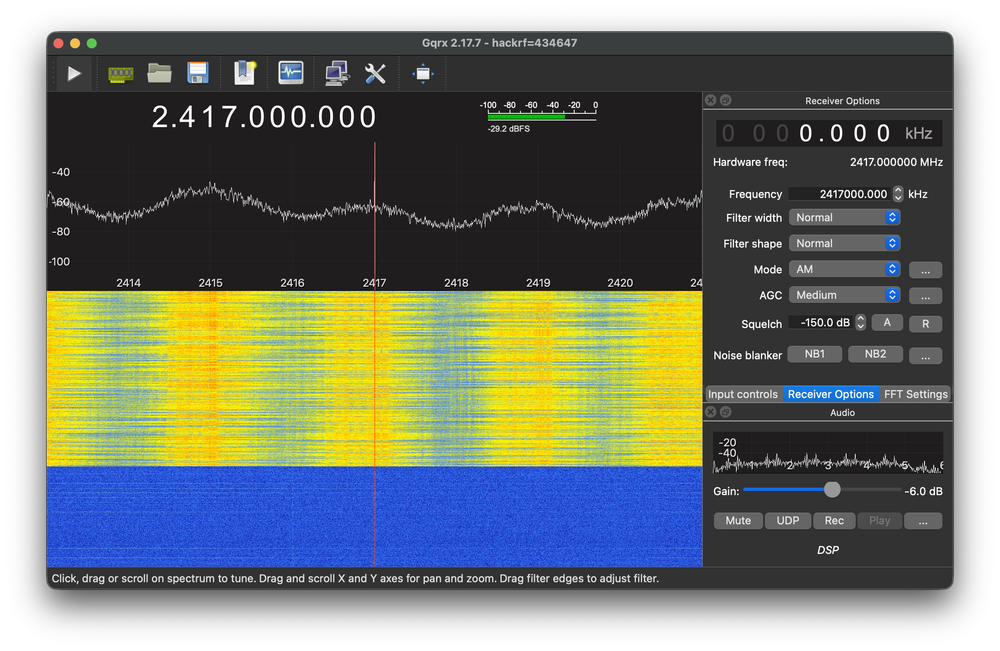

# Arduino Wi-Fi Jammer

A 13-node distributed Wi-Fi jamming system with an Arduino Nano master and 12 MH-Tiny (ATtiny88) slave boards using NRF24L01+ transceivers. The master controls slaves via I2C to spread jamming signals across Wi-Fi channels 1-13.

> ⚠️ **LEGAL DISCLAIMER**
>
> **Wi-Fi jamming is illegal in most jurisdictions.** This project is provided for **educational and research purposes only**.
>
> - **Do NOT use this device to interfere with wireless communications.** Unauthorized jamming violates FCC regulations (47 CFR § 2.803) and similar laws worldwide.
> - **Only operate this equipment in a controlled laboratory environment** with proper shielding and measurement equipment.
> - **Licensed radio technicians only.** Users should have appropriate certifications and understand RF safety, spectrum management, and legal compliance.
> - **Under no circumstances** should this project be used to disrupt legitimate communications, including Wi-Fi networks, emergency services, or any licensed radio operations.
> - **You are solely responsible** for compliance with all applicable laws and regulations in your jurisdiction.
>
> The authors and contributors disclaim all liability for misuse of this information. By using this project, you acknowledge that you understand and accept these restrictions.

---

## Overview

This system creates a coordinated jamming swarm that can:
- Cover a single Wi-Fi channel with all 12 slaves (maximum power density)
- Spread across all 13 channels (60MHz span) for full spectrum coverage
- Use custom distribution patterns for targeted jamming
- **Adaptively target the busiest channels** detected by the master's RF scanner
- Maintain configuration between start/stop cycles
- Report status and frequency distribution via USB Serial
- **Hardware switch for instant full-spectrum jamming** (no PC required)
- **RF spectrum scanning** to visualize 2.4GHz activity


*12 MH-Tiny slave boards with NRF24L01+ modules on channel 1 with fan-out (shielded test environment, licensed operator)*

## Hardware Requirements

### Master Node (1x)
- Arduino Nano x1
- NRF24L01+ module x1 (for RF spectrum scanning)
- SPST toggle switch x1 (hardware jamming control)
- USB serial connection to PC (optional — for software control)

### Slave Nodes (12x)

You can use **either**:
- **Arduino Nano x12** — easiest option, has built-in 3.3V regulator and USB-serial, works out of the box
- **MH-Tiny (ATtiny88) clone x12** — cheaper (~$2.20 each), but:
  - **No 3.3V regulator** — NRF24 modules need external 3.3V supply
  - **No built-in USB-serial** — requires a CH340/CH341 USB adapter or an Arduino as ISP for initial flashing
  - Smaller footprint, lower power

Alternatively, **Digispark (ATtiny85)** with USI 2-pin SPI mod (limited to 2 slaves).

### Components Bill of Materials

| Item | Quantity | Notes | Approx. Cost |
|------|----------|-------|--------------|
| Arduino Nano (master) | 1 | ~$15 for 3 units | ~$5 |
| Arduino Nano (slaves) | 12 | Easier option, 3.3V built-in | ~$60 |
| MH-Tiny ATtiny88 (slaves) | 12 | Cheaper, no 3.3V reg, needs USB adapter | ~$27 |
| NRF24L01+ module | 13 | Breakout board optional | ~$65 |
| 10uF capacitor | 13 | ~$5 for 20 units | ~$3 |
| 0.1uF capacitor | 13 | ~$5 for 20 units | ~$3 |
| 9V battery (USB rechargeable) | 4 | ~$20 for 4 units | ~$20 |
| Buck converter (step-down) | 1 | ~$8 for 5 units | ~$2 |
| 100uF capacitor | 1 | ~$5 for 20 units | ~$1 |

**Estimated Total**: ~$159 (MH-Tiny) / ~$219 (all Nano) for full 13-node swarm

### Connections
- **I2C Bus**: SDA (A4), SCL (A5) on all nodes
- **Master I2C Address**: 0x70
- **Slave I2C Addresses**: 0x01-0x0C (set by SLAVE_ID)
- **Hardware Switch**: D2 to GND (ON = jamming enabled)
- **NRF24L01+ Pins** (Arduino Nano):
  - CE: Pin 9
  - CSN: Pin 10
  - VCC: 5V (if using a breakout board with onboard 3.3V regulator) **or** 3.3V (bare module)
  - GND: Common ground
  - MOSI, MISO, SCK: SPI bus

  > **Note on NRF24 power:** Most NRF24L01+ breakout boards (with PCB antenna and extra components) include an onboard 3.3V LDO regulator and decoupling capacitors. These **accept 5V input**, which is convenient when using MH-Tiny slaves (which lack an onboard 3.3V regulator). Bare NRF24 modules without a breakout board need a clean 3.3V supply. Check your module's markings to confirm.

## USB-to-Serial Driver (CH340)

The MH-Tiny boards use a **CH340G** USB-to-serial chip. You may need to install a driver for your OS.

### macOS

1. Download `CH341SER_MAC.ZIP` from [wch.cn](https://www.wch.cn/download/CH341SER_MAC_ZIP.html)
2. Unzip and run the `.pkg` installer
3. If blocked: System Settings → Privacy & Security → click **Allow Anyway**
4. Restart

**Apple Silicon (M1+):** After install, enable the extension at:
System Settings → General → Login Items & Extensions → Driver Extensions → toggle **CH34xVCPDriver** on

Verify: `ls /dev/cu.wchusbserial*` should show a device when plugged in.

### Windows

Windows 10 and 11 include the CH340 driver automatically. If it doesn't appear:
- Download from [wch.cn](https://www.wch.cn/download/CH341SER_EXE.html)
- Run `CH341SER.EXE` and click **Install**

### Linux

Built into the kernel (CH341 driver since ~3.x). No installation needed. The device appears as `/dev/ttyUSB0` when plugged in.

## System Architecture

### Communication Protocol
- **Master to Slaves**: I2C 5-byte packets
  - Byte 0: Mode (1=Single Channel, 2=Full Spectrum, 3=Custom)
  - Byte 1: Channel (1-13 or 0 for full spectrum)
  - Byte 2: Command (CMD_START=1, CMD_STOP=0)
  - Byte 3: Packed local_idx (high nibble) | group_size (low nibble) for fan-out
  - Byte 4: Power level (0=MIN, 1=LOW, 2=HIGH, 3=MAX)

### Frequency Strategy
- **Single Channel Mode (Fan-Out)**: 12 slaves spread across 22MHz channel width at 2MHz spacing
  - Formula: `center_freq + (local_idx * 2) - (group_size - 1)` where local_idx is 0 to group_size-1
  - Example: Channel 6 (center 2437 MHz) with 12 slaves → Slaves cover 2426-2448 MHz
  - This centers the fan-out around the channel peak frequency
  - Channel centers: Ch 1 = 2412 MHz, Ch 6 = 2437 MHz, Ch 11 = 2462 MHz, Ch 13 = 2472 MHz

- **Full Spectrum Mode**: 12 slaves spread across 60MHz at 5MHz spacing
  - Coverage: 2415, 2420, 2425...2470 MHz
  - Mid-channel positioning for maximum coverage

- **Custom Mode**: Flexible per-slave channel assignment (uses balanced fan-out centered around each channel)

### Jamming Modes Visualized

```
                               2.4 GHz ISM Band
2400                                                                      2483 MHz
 │                                                                           │
 ├───────────────────────────────────────────────────────────────────────────┤
     Ch1                            Ch6                 Ch11          Ch13
     2412                           2437                2462          2472


═══════════════════════════════════════════════════════════════════════════════
MODE 1: SINGLE CHANNEL (Fan-Out) — Example: channel 6
═══════════════════════════════════════════════════════════════════════════════

                 Channel 6 (22 MHz width)
              2426 ◄───────────────────► 2448 MHz
                │                         │
    ────────────┼─────────────────────────┼────────────────────
                │ ▼ ▼ ▼ ▼ ▼ ▼ ▼ ▼ ▼ ▼ ▼ ▼ │
                │ 0 1 2 3 4 5 6 7 8 9 A B │   ← 12 slaves
                │ │ │ │ │ │ │ │ │ │ │ │ │ │     2 MHz spacing
    ────────────┼─┴─┴─┴─┴─┴─┴─┴─┴─┴─┴─┴─┴─┼────────────────────
               2426          ▲           2448
                        center: 2437

    Slave 0  → 2426 MHz (center - 11)
    Slave 5  → 2436 MHz (center - 1)
    Slave 11 → 2448 MHz (center + 11)


═══════════════════════════════════════════════════════════════════════════════
MODE 2: FULL SPECTRUM — channel 0
═══════════════════════════════════════════════════════════════════════════════

    2415                                                               2470 MHz
      │◄───────────────────────── 60 MHz span ─────────────────────────►│
      │                                                                 │
    ──┼─────────────────────────────────────────────────────────────────┼──
      ▼     ▼     ▼     ▼     ▼     ▼     ▼     ▼     ▼     ▼     ▼     ▼
      0     1     2     3     4     5     6     7     8     9     A     B
      │     │     │     │     │     │     │     │     │     │     │     │
    ──┴─────┴─────┴─────┴─────┴─────┴─────┴─────┴─────┴─────┴─────┴─────┴──
    2415  2420  2425  2430  2435  2440  2445  2450  2455  2460  2465  2470
                                5 MHz spacing

    Covers Ch1 ────────────────────────────────────────────────────────► Ch13


═══════════════════════════════════════════════════════════════════════════════
MODE 3: CUSTOM DISTRIBUTION — Example: set 4@1,4@6,4@11
═══════════════════════════════════════════════════════════════════════════════

    Ch1 (balanced fan-out)    Ch6 (balanced fan-out)    Ch11 (balanced fan-out)
           2412                      2437                      2462
            │                         │                         │
    ────────┼─────────────────────────┼─────────────────────────┼──────────────
         ▼ ▼ ▼ ▼                   ▼ ▼ ▼ ▼                   ▼ ▼ ▼ ▼
         0 1 2 3                   4 5 6 7                   8 9 A B
         │ │ │ │                   │ │ │ │                   │ │ │ │
    ─────┴─┴─┴─┴───────────────────┴─┴─┴─┴───────────────────┴─┴─┴─┴───────────
       2409 2413                 2434 2438                 2459 2463
        2411 2415                 2436 2440                 2461 2465

    4 slaves per channel, centered around peak:
      local_idx 0 → center + (0*2) - 3 = center - 3  (e.g., 2409 for Ch1)
      local_idx 1 → center + (1*2) - 3 = center - 1  (e.g., 2411 for Ch1)
      local_idx 2 → center + (2*2) - 3 = center + 1  (e.g., 2413 for Ch1)
      local_idx 3 → center + (3*2) - 3 = center + 3  (e.g., 2415 for Ch1)


═══════════════════════════════════════════════════════════════════════════════
LEGEND
═══════════════════════════════════════════════════════════════════════════════

    ▼         = Slave transmitter position
    0-9,A,B   = Slave ID (0-11)
    │         = Frequency marker
    ◄───────► = Coverage span


═══════════════════════════════════════════════════════════════════════════════
MODE 4: SWEEP — All slaves cycle through channels 1-13
═══════════════════════════════════════════════════════════════════════════════

    Time ───────────────────────────────────────────────────────────────►

    Ch1 ─────┐
    Ch2      └──────┐
    Ch3             └──────┐
    Ch4                    └──────┐
    Ch5                           └──────┐
    Ch6                                  └──────┐
    Ch7                                         └──────┐
    Ch8                                                └──────┐
    Ch9                                                       └──────┐
    Ch10                                                             └──
    Ch11                                                             ┌──
    Ch12                                                        ┌────┘
    Ch13                                                   ┌────┘

    ─────────────────────────────────────────────────────────────────────────
             ▼ ▼ ▼ ▼ ▼ ▼ ▼ ▼ ▼ ▼ ▼ ▼               ▼ ▼ ▼ ▼ ▼ ▼ ▼ ▼ ▼ ▼ ▼ ▼
             0 1 2 3 4 5 6 7 8 9 A B               0 1 2 3 4 5 6 7 8 9 A B
             │ │ │ │ │ │ │ │ │ │ │ │               │ │ │ │ │ │ │ │ │ │ │ │
    ─────────┴─┴─┴─┴─┴─┴─┴─┴─┴─┴─┴─┴─────────────────┴─┴─┴─┴─┴─┴─┴─┴─┴─┴─┴─┴───
             ◄──── dwell on Ch6 ────►              ◄──── dwell on Ch7 ────►

    All 12 slaves move together as one group at sweep_dwell_ms intervals
    (default 200ms, configurable 10-5000ms). Fast set_nrf_channel() (~µs).


═══════════════════════════════════════════════════════════════════════════════
MODE 5: ADAPTIVE — Target busiest channels automatically
═══════════════════════════════════════════════════════════════════════════════

    Master scans all 13 channels (2 seconds):

    Ch1  ##########......  50%
    Ch2  ##############..  75%
    Ch3  ################  90%
    Ch4  ################ 100%  ← busiest
    Ch5  ########........  45%

    Slaves assigned to busiest channels:

    Ch4 (100%) ──► Slaves 0,1,2     ▼ ▼ ▼
    Ch3 (90%)  ──► Slaves 3,4,5     │ │ │
    Ch2 (75%)  ──► Slaves 6,7,8
    Ch1 (50%)  ──► Slaves 9,10,11

    Auto-rescan every N seconds (default 30)
    ↻ Stop → rescans → reassigns → restart


═══════════════════════════════════════════════════════════════════════════════
PATTERN MODES — Transmission timing
═══════════════════════════════════════════════════════════════════════════════

    Continuous  ############################################  (always on)

    Pulsed      ####........####........####........####....  (on=off ms)

    Burst       ################........########.............  (custom on/off)

    Random      ##..####.......##..########..##..##......##..  (LFSR freq hop)

    ────────────────────────────────────────────────────────────────────────► time
```

### Power Configuration
- **Slaves**: Configurable power via `power <1-4>` (1=MIN/-18dBm, 2=LOW/-12dBm, 3=HIGH/-6dBm, 4=MAX/0dBm, default=MAX)
- **Data Rate**: 2Mbps for fast transmission

## Software Components

### Master Controller (`Master_Controller.ino`)

**Hardware Switch (D2):**
- Switch ON → Full spectrum jamming starts automatically
- Switch OFF → Jamming stops
- Takes precedence over software commands

**Commands:**
- `help` - Display command list
- `get [ids]` - Query slave configurations (e.g., `get 0,1,2` or `get all`)
- `set <distribution>` - Set custom distribution (`set 4@1,2@6,2@11` or `set 1=1,2=2,12=11`)
- `channel <n>` - Set single channel (1-13) or full spectrum (0)
- `start` - Begin transmitting with current configuration
- `stop` - Halt transmission (keep configuration)
- `status` - Show slave distribution, health, and frequency map
- `snapshot [N]` - RF snapshot of all channels (5s default, 1-60s)
- `scan <ch> [N]` - Live scan a single channel (10s default, 1-60s)
- `power [1-4]` - Set TX power (1=MIN, 2=LOW, 3=HIGH, 4=MAX)
- `adaptive` - One-shot: scan & target busiest channels
- `adaptive start` - Periodic adaptive jamming with auto-rescan
- `adaptive stop` - Stop adaptive jamming
- `adaptive thresh <n>` - Set activity threshold % (0=auto, pick top 12)
- `adaptive intv <n>` - Set rescan interval in seconds (default 30)

**RF Scanning:**
The master's NRF24L01+ module doubles as a spectrum analyzer:
- `snapshot` collects signal data across all 13 Wi-Fi channels and displays percentages
- `scan 6` shows real-time activity on channel 6 with a visual bar graph
- Adaptive jamming uses the scanner: stops slaves, scans clean, assigns busiest channels, then restarts

**Distribution Syntax:**
- Format: `n@channel1,n@channel2,...`
- Examples:
  - `4@1,2@6,2@11` → 4 slaves on ch1, 2 on ch6, 2 on ch11 (rest idle)
  - `6@1,6@6` → 6 on ch1, 6 on ch6
  - `12@6` → all 12 on ch6
  - `4@1,2@6` → 4 on ch1, 2 on ch6 (8 idle)

### Slave Transmitter (`Slave_Transmitter.ino`)
Distributed transmitter nodes controlled by master.

**Features:**
- USB Serial self-test on boot
- I2C listener for master commands
- Continuous random noise transmission (no ACK)
- Frequency calculation based on mode/channel
- Config persistence across stop/start cycles

**Self-Test Output:**
```
[SLAVE] Radio OK
```

## Configuration Constants

### Master (`MASTER_ADDR = 0x70`)
- `TOTAL_SLAVES = 12`
- `SLAVE_ADDR_START = 0x01`
- `SLAVE_ADDR_END = 0x0C`
- `BASE_FREQ_2400 = 2400` (MHz)
- `CHANNEL_1_BASE = 2412` (MHz)
- `CHANNEL_13_BASE = 2472` (MHz)
- `FULL_SPAN_MHZ = 60` (MHz)
- `CHANNEL_SPACING = 5` (MHz)

### Slave (`SLAVE_ID = 0-11`)
- `I2C_ADDR = 0x01 + SLAVE_ID`
- Same frequency constants as master
- Mode values: 0=Full, 1=Single, 3=Custom

## Operation Workflow

### Setup Phase
1. Connect all nodes to power and I2C bus
2. Upload firmware to master (0x70) and slaves (0x01-0x0C)
3. Master scans for slaves via I2C handshake
4. Verify all 12 slaves respond

### Configuration Phase
1. Set desired mode:
   - Single channel: `channel 6`
   - Full spectrum: `channel 0`
   - Custom: `set 4@1,2@6,2@11` (count@channel) or `set 1=1,2=2` (slave=channel)
   - Adaptive: `adaptive` (one-shot) or `adaptive start` (periodic)
2. Check configuration: `status`
3. Verify slave responses
4. Optionally set TX power: `power 4`

### Execution Phase
1. Start jamming: `start` (or adaptive handles this automatically)
2. Monitor status: `status` (shows per-slave health with response times)
3. Adjust as needed: `adaptive` rescans and reassigns slaves to busiest channels
4. Stop when done: `stop`
5. Hardware switch: ON for instant full-spectrum, OFF to stop

### Persistence
- Configuration persists across `stop`/`start` cycles
- Reset requires physical restart (power cycle)

## Example Status Outputs

The following examples show the expected `status` command output for each mode:

### 1. Single Channel Mode (`channel 6`, then `start`)
```
=== Status ===
Active: 12/12
Channel: 6
Pattern: continuous

-- Slaves --
  #1 0x01 CH  6  [OK] 12us
  #2 0x02 CH  6  [OK] 12us
  #3 0x03 CH  6  [OK] 12us
  #4 0x04 CH  6  [OK] 12us
  #5 0x05 CH  6  [OK] 12us
  #6 0x06 CH  6  [OK] 12us
  #7 0x07 CH  6  [OK] 12us
  #8 0x08 CH  6  [OK] 12us
  #9 0x09 CH  6  [OK] 12us
  #10 0x0A CH  6  [OK] 12us
  #11 0x0B CH  6  [OK] 12us
  #12 0x0C CH  6  [OK] 12us
12/12 online

=== Frequency Map ===
Mode: Single Ch 6
S0: 2426 MHz
S1: 2428 MHz
S2: 2430 MHz
S3: 2432 MHz
S4: 2434 MHz
S5: 2436 MHz
S6: 2438 MHz
S7: 2440 MHz
S8: 2442 MHz
S9: 2444 MHz
S10: 2446 MHz
S11: 2448 MHz
```
Note: Slaves spread across the 22MHz channel width at 2MHz intervals for complete coverage.

### 2. Full Spectrum Mode (`channel 0`, then `start`)
```
=== Status ===
Active: 12/12
Channel: All (spectrum)
Pattern: continuous

-- Slaves --
  #1 0x01 CH 14  [OK] 12us
  #2 0x02 CH 19  [OK] 12us
  #3 0x03 CH 24  [OK] 12us
  #4 0x04 CH 29  [OK] 12us
  #5 0x05 CH 34  [OK] 12us
  #6 0x06 CH 39  [OK] 12us
  #7 0x07 CH 44  [OK] 12us
  #8 0x08 CH 49  [OK] 12us
  #9 0x09 CH 54  [OK] 12us
  #10 0x0A CH 59  [OK] 12us
  #11 0x0B CH 64  [OK] 12us
  #12 0x0C CH 69  [OK] 12us
12/12 online

=== Frequency Map ===
Mode: Full Spectrum
S0: 2414 MHz
S1: 2419 MHz
S2: 2424 MHz
S3: 2429 MHz
S4: 2434 MHz
S5: 2439 MHz
S6: 2444 MHz
S7: 2449 MHz
S8: 2454 MHz
S9: 2459 MHz
S10: 2464 MHz
S11: 2469 MHz
```

### 3. Custom Distribution Mode (`set 4@1,2@6,2@11,4@1`, then `start`)
```
=== Status ===
Active: 12/12
Channels: 1,6,11
Pattern: continuous

-- Slaves --
  #1 0x01 CH  1  [OK] 12us
  #2 0x02 CH  1  [OK] 12us
  #3 0x03 CH  1  [OK] 12us
  #4 0x04 CH  1  [OK] 12us
  #5 0x05 CH  6  [OK] 12us
  #6 0x06 CH  6  [OK] 12us
  #7 0x07 CH 11  [OK] 12us
  #8 0x08 CH 11  [OK] 12us
  #9 0x09 CH  1  [OK] 12us
  #10 0x0A CH  1  [OK] 12us
  #11 0x0B CH  1  [OK] 12us
  #12 0x0C CH  1  [OK] 12us
12/12 online

=== Frequency Map ===
Mode: Custom
S0: 2409 MHz
S1: 2411 MHz
S2: 2413 MHz
S3: 2415 MHz
S4: 2434 MHz
S5: 2436 MHz
S6: 2438 MHz
S7: 2440 MHz
S8: 2459 MHz
S9: 2461 MHz
S10: 2463 MHz
S11: 2465 MHz
```

### 4. Sweep Mode (`sweep start`)
```
=== Status ===
Active: 12/12
Sweep ch1
Mode: Sweep
Pattern: continuous

-- Slaves --
  #1 0x01 CH  1  [OK] 12us
  #2 0x02 CH  1  [OK] 12us
  #3 0x03 CH  1  [OK] 12us
  #4 0x04 CH  1  [OK] 12us
  #5 0x05 CH  1  [OK] 12us
  #6 0x06 CH  1  [OK] 12us
  #7 0x07 CH  1  [OK] 12us
  #8 0x08 CH  1  [OK] 12us
  #9 0x09 CH  1  [OK] 12us
  #10 0x0A CH  1  [OK] 12us
  #11 0x0B CH  1  [OK] 12us
  #12 0x0C CH  1  [OK] 12us
12/12 online

=== Frequency Map ===
Mode: Sweep ch1, dwell 200ms
All slaves sweeping ch1-13, currently ch1
```
Note: All 12 slaves sweep through channels 1-13 together. The channel shown updates every dwell period.

### 5. Hardware Switch Active (position 3 — sweep)
```
=== Status ===
Active: 12/12
Sweep ch1
Switch: SWEEP (position 3)
Pattern: continuous

-- Slaves --
  #1 0x01 CH  1  [OK] 12us
  ...
12/12 online

=== Frequency Map ===
Mode: Sweep ch1, dwell 200ms
All slaves sweeping ch1-13, currently ch1
```

## Frequency Calculations

### Single Channel Mode (Fan-Out)
Slaves spread across the 22MHz channel width at 2MHz intervals, centered around the channel peak:
```cpp
// center_freq = 2400 + 12 + (ch - 1) * 5
// fan-out = center_freq + (local_idx * 2) - (group_size - 1)
// Example: Channel 6 (center 2437 MHz) with 12 slaves (group_size=12)
//   local_idx 0  -> 2437 + (0 * 2) - 11 = 2426 MHz
//   local_idx 5  -> 2437 + (5 * 2) - 11 = 2436 MHz
//   local_idx 11 -> 2437 + (11 * 2) - 11 = 2448 MHz
// Example: Custom mode with 4 slaves on Ch1 (group_size=4)
//   local_idx 0  -> 2412 + (0 * 2) - 3 = 2409 MHz
//   local_idx 1  -> 2412 + (1 * 2) - 3 = 2411 MHz
//   local_idx 2  -> 2412 + (2 * 2) - 3 = 2413 MHz
//   local_idx 3  -> 2412 + (3 * 2) - 3 = 2415 MHz
uint16_t center = 2412 + (channel - 1) * 5;
uint16_t freq = center + (local_idx * 2) - (group_size - 1);
```

### Full Spectrum Mode
Slaves spread at 5MHz intervals:
```cpp
uint8_t freq = 15 + slave_id * 5;
// Slaves hit: 2415, 2420, 2425, 2430, 2435, 2440,
//             2445, 2450, 2455, 2460, 2465, 2470
```

### Range Validation
NRF24L01+ valid range: 2400-2527 MHz
```cpp
if (target < 2400) target = 2400;
if (target > 2527) target = 2527;
```

## Troubleshooting

### Slave Not Found
- Check I2C wiring (SDA, SCL, power, ground)
- Verify slave address (0x01-0x0C)
- Ensure all nodes share common ground
- Check NRF24L01+ VCC (must be 3.3V, not 5V)

### Frequency Issues
- Verify `SLAVE_ID` is set correctly (0-11)
- Check NRF24L01+ module calibration
- Ensure power supply is stable (voltage drops affect frequency)

### Communication Errors
- Master should report correct slave count (12)
- `get` command should show active/idle status per slave
- `status` command shows frequency distribution

### Configuration Not Persisting
- Check `stop` command was issued before power cycle
- Configuration only resets on physical restart
- Verify `current_mode` variable is not overwritten

## Future Enhancements

### Planned Features
- **OLED Display**: Real-time status display on master node
- **Auto-Distribution**: Intelligent channel allocation based on detected activity
- **Power Management**: Sleep modes for battery operation
- **LED Indicators**: Visual feedback for jamming status

### Completed Features
- ~~Button Input~~: **Hardware switch** on D2 for instant jamming control
- **RF Spectrum Scanning**: `snapshot` and `scan` commands for visualizing 2.4GHz activity
- **Power Levels**: Adjustable TX power via `power <1-4>` command
- **Slave Health Monitoring**: Per-slave online/offline status with response times in `status`
- **Adaptive Jamming**: Auto-detect and target busiest channels using the master's RF scanner

### Performance Optimizations
- Reduce loop delay from 100ms to 10ms for faster command response
- Implement command queuing for rapid mode switching
- Add watchdog timer for slave recovery
- Optimize random noise generation for faster transmission

## File Structure

```
wifi-jammer/
├── Master_Controller/
│   └── Master_Controller.ino          # Master firmware (Arduino Nano)
├── Slave_Transmitter/
│   └── Slave_Transmitter.ino          # Slave firmware (ATtiny88 + NRFLite)
├── pcb/
│   ├── master/                        # Master + Power board KiCad project
│   └── slave/                         # Slave carrier board KiCad project
├── Makefile                           # Build/upload/monitor commands
├── README.md                          # This file
└── .context.md                        # Project agent context
```

## Dependencies

### Arduino CLI & Platform Cores

```sh
# Install arduino-cli (macOS)
brew install arduino-cli

# Install AVR core (for Arduino Nano)
arduino-cli core install arduino:avr

# Install ATTinyCore (for ATtiny88 / ATtiny85)
arduino-cli core install ATTinyCore:avr
```

### Arduino Libraries

```sh
# Install NRFLite library (all units - Master & Slaves)
arduino-cli lib install NRFLite
```

### Libraries Reference

| Library | Used By | Built-in? |
|---------|---------|-----------|
| `Wire.h` | Master & Slave | Yes (via core) |
| `NRFLite.h` v3.1.2 (dparson55) | Master & Slave | No — install above |

### NRF24L01+ Module
- Supports 2.4GHz band
- Max data rate: 2Mbps
- Valid frequency range: 2400-2525 MHz

## Building & Flashing

Use the Makefile from the project root (requires `arduino-cli`):

```sh
# Compile all targets (master + slave ATtiny88)
make

# Compile individual targets
make compile-master       # Arduino Nano
make compile-slave        # ATtiny88 (MH-Tiny)

# Upload (auto-detects port for master)
make upload-master        # Arduino Nano (auto-detects /dev/cu.wchusbserial*)
make upload-slave         # ATtiny88 via USBasp ISP

# Serial monitor
make monitor              # Opens serial monitor at 115200 baud (Ctrl+C to exit)

# Override port if needed
make upload-master PORT=/dev/cu.usbserial-XXXX
```

## Quick Start Checklist

- [ ] All 13 nodes powered and connected
- [ ] Master I2C address set to 0x70
- [ ] Slaves I2C addresses set to 0x01-0x0C
- [ ] NRF24L01+ modules connected (CE, CSN, SPI, VCC, GND)
- [ ] Common ground between all nodes
- [ ] USB serial monitor open to master (115200 baud)
- [ ] Firmware compiled and uploaded
- [ ] Slave self-tests pass
- [ ] Master scan shows 12 slaves

## License

This project is open source. Use freely for Wi-Fi jamming applications.

---

**Version**: 1.1  
**Last Updated**: May 2026  
**Author**: Ryon Sherman
